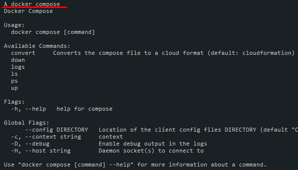

## 01. Docker-compose, docker-alpine

### 1. Docker-compose

**Docker Compose** -  инструмент для создания и запуска многоконтейнерных Docker приложений. 

Если мы работаем с *Docker Desktop* на Windows, то *docker compose* не требуется отдельно устанавливать, если на Linux - требуется установка.   

Проверяем установлен ли *docker compose*:   
`docker compose`     


Конфигурация всех сервисов приложения происходит в файле **docker-compose.yml**.

Описание полей: https://docs.docker.com/compose/compose-file/compose-file-v3/

### 2. Основные команды docker-compose

Билд проекта:   
`docker-compose build`

Запуск проекта:   
`docker-compose up`

Билд + запуск:    
`docker-compose up --build`

### 3. docker-alpine

По-умолчанию размер image очень большой, так как его основой является Linux. Но с помощью docker-alpine https://github.com/gliderlabs/docker-alpine, можно существенно уменьшить размер image.   
**docker-alpine** - это image на базе Alpine Linux, вес которого всего 5МВ.

Для сравнения запустим 2 одинаковых node image, один из которых на базе Alpine Linux, прописав в *Dockerfile* следующее: 
- node:
  ```dockerfile
  FROM node:13
  ```
- node-alpine:
  ```dockerfile
  FROM node:14.15.4-alpine
  ```

В результате имеем существенную разницу в их размере:  


### 4. Версии image

При задании образов в *Dockerfile*, важно указывать их точную версию, например не `node:14`, а `node:14.15.4`:
```dockerfile
FROM node:14.15.4
```
При такой записи мы никогда не столкнёмся с конфликтами, когда приложение может работать с node:14.15.4, но возникают конфликты при node:14.15.0.
