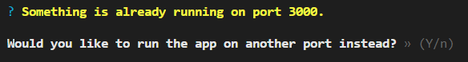

## 04. Сервис фронтенда

### Создание и запуск проекта в development-mode

Находясь в корне проекта, создаем на базе react сервис frontend:   
`npm init react-app frontend`

Переходим в директорию frontend и запускаем проект на dev-сервере:    
`npm run start`

После этого мы видим в консоли сообщение, которое говорит, что порт 3000 занят (на порту 3000 у нас работает api-сервис) и предлагает запустить проект на другом порту. Ответив Yes - проект будет запущено на порту 3002:  
   

Поскольку react по умолчанию запускается на порту 3000 - необходимо проследить, чтоб данный порт не был занят другими контейнерами внутри *docker-compose.yml*.

### Запуск фронтенда в production-mode

Комманда `npm run build` создает продакшен билд в директории *build*.     
Чтобы запустить проект из директории *build* необходимо установить static server: `npm i -g serve`   
Запуск проекта из директории *build* (по умолчанию используется порт 5000): `serve -s build`    
Запуск проекта из директории *build* на порту 3000: `serve -s build -l 3000`    

---

Наша задача - научить docker создавать frontend сервис и запускать его в development и production mode- см. файлы 
- *docker-compose.yml* 
- *docker-compose.development.yml*
- *frontend\Dockerfile*