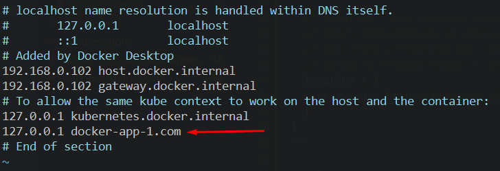
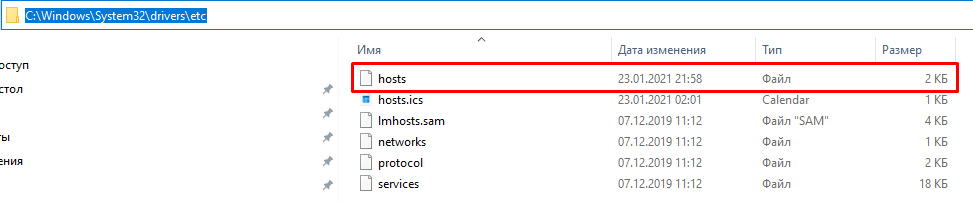
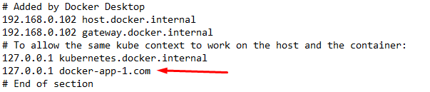

## 05. Nginx

Nginx - веб-сервер и прокси-сервер.

Алгоритм работы веб приложений: когда пользователь делает запрос к домену, этот запрос автоматически переходит на ip-адресс сервера с портом 80, который привязан к этому домену.    

Наша задача - запустить Nginx на порте 80, который будет распределять запросы на разные порты к разным сервисам нашего приложения.

### 1. Создаем сервис 'nginx'

Добавляем внутрь *docker-compose.yml* новый сервис 'nginx':
```yml
version: "3"

# Указываем, какие сервисы DC должен сбилдить и запустить
services:
  # Сервис 'nginx'
  nginx:
    # Качаем образ nginx, на базе которого нужно создать данный сервис
    image: nginx:stable-alpine
    # Задаем имя контейнеру, которое будет отображаться при вводе комманды `docker ps`
    container_name: docker-nginx
    ports:
      # Говорим, что к 80-му порту контейнера можно получить доступ через
      # 80-й порт хоста.
      # хост:контейнер 
      - "80:80"
    # Указываем volume для данного контейнера, чтобы сохранить его на хосте
    volumes: 
      # Данные хоста по адрессу ./nginx/nginx.conf.prod положить
      # внутрь контейнера по адрессу /etc/nginx/conf.d/nginx.conf
      - ./nginx/nginx.conf.prod:/etc/nginx/conf.d/nginx.conf
    depends_on: 
      # Сервис frontend должен быть доступен раньше, чем сервис nginx, 
      # иначе nginx упадет, если он не сможет спроксировать запрос на сервис, 
      # который ранится
      - frontend
```

### 2. Создаем конфигурацию nginx для production

Создаем файл *nginx\nginx.conf.prod*:
```js
server {
  // listen - указывам, что слушаем порт 80
  listen 80;

  // server_name - указываем домен
  server_name docker-app-1.com;

  // location - все запросы, которые будут начинаться с docker-app-1.com + / 
  // будут проксированы на адресс http://frontend:3000
  // Хост http://frontend был создан docker-compose в момент,
  // когды мы создали сервис с именем frontend
  location / {
    proxy_pass http://frontend:3000;
  }
}
```

### 3. Привязка домена к localhost 

- **linux**:

Вводим комманду `sudo vim /etc/hosts` - в редакторе vim откроется файл hosts, в который нужно добавить название домена `docker-app-1.com` и к какому адрессу он привязан (127.0.0.1 = localhost):    


- **windows**

Переходив в папку `C:\Windows\System32\drivers\etc` и находим файл hosts без расширения:   


Открываем «Блокнот» от имени администратора, открываем файл hosts и добавляем название домена `docker-app-1.com` и к какому адрессу он привязан (127.0.0.1 = localhost):    


---

Теперь если запустить проект `docker-compose up --build` и обратится по адрессу docker-app-1.com, то браузер не будет искать этот домен в интернете, а произойдет редирект на localhost хоста, порт 80.   
Так как выше мы прописали, что на 80 порту у нас работает сервис 'nginx', он вступает в работу:
```yml
  nginx:
    image: nginx:stable-alpine
    container_name: docker-nginx
    ports:
      # Говорим, что к 80-му порту контейнера можно получить доступ через
      # 80-й порт хоста.
      # хост:контейнер 
      - "80:80"
```
'nginx' перенаправляет нас на домен http://frontend:3000, поскольку такое поведение было описано нами в *nginx\nginx.conf.prod*.

Далее, внутри *docker-compose.yml*, **для сервиса frontend убираем порты, поскольку с помощью этих портов мы достигали сервис frontend снаружи, что есть небезопасно**:
```yml
version: "3"
services:
  frontend:
    build: ./frontend
    container_name: docker-frontend
    command: serve -s build -l 3000
    # Порты описано внутри *nginx\nginx.conf.prod*
    # ports:
    #   - "3000:3000"
    restart: unless-stopped
```
**Теперь все наши запросы идут через 'nginx' и он решает из внутренней сети докера какой сервис и на каком порту вызвать**. 

Если бы мы не выполнили подобную настройку nginx, то любой пользователь мог бы легко из браузера получать доступ к нашим API.