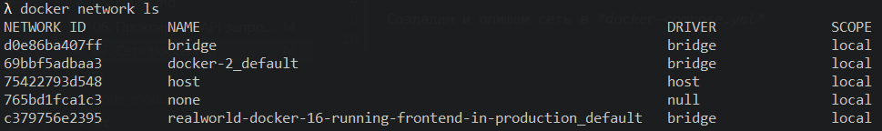
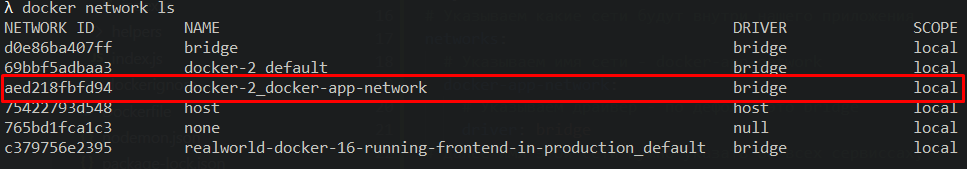

## 07. Сети docker

Из предыдущего урока мы увидели, что Docker-compose создал для нас внутреннюю сеть, благодаря которой все сервисы могут комуницировать между собою, используя для этого хосты, которые предоставляет docker - http://api:3201, http://auth:3202 (где http://api - имя сервиса, 3201 - внутренний порт контейнера) и т.д.   

Просмотреть список сетей:   
`docker network ls`



Мы понимаем, что docker создал для нас сеть, но какую конкретно из скриншота выше мы не понимаем.

Чтобы прояснить ситуацию - создадим и опишем самостоятельно сеть внутри *docker-compose.yml*. Когда мы делаем это вручную, мы можем указать каждому сервису какую сеть использовать и должен ли он вообще быть в нашей сети. Если мы этого не укажем, то по дефолту все сервисы будут внутри сети. 

Создадим сеть с именем docker-app-network внутри *docker-compose.yml*:
```yml
# Указываем какие сети будут внутри нашего приложения
networks: 
  # Указываем имя сети - docker-app-network
  docker-app-network:
    # Указываем драйвер - по дефолту это bridge
    driver: bridge
# Далее имя этой сети нужно указать во всех сервиссах,
# которые нужно подключить к этой сети
```

Указываем всем сервисам, что они работают внутри сети docker-app-network:
```yml
networks: 
  - docker-app-network
```

Теперь если просмотреть список сетей `docker network ls` еще раз, мы увидим в списке сеть которую мы создали:

